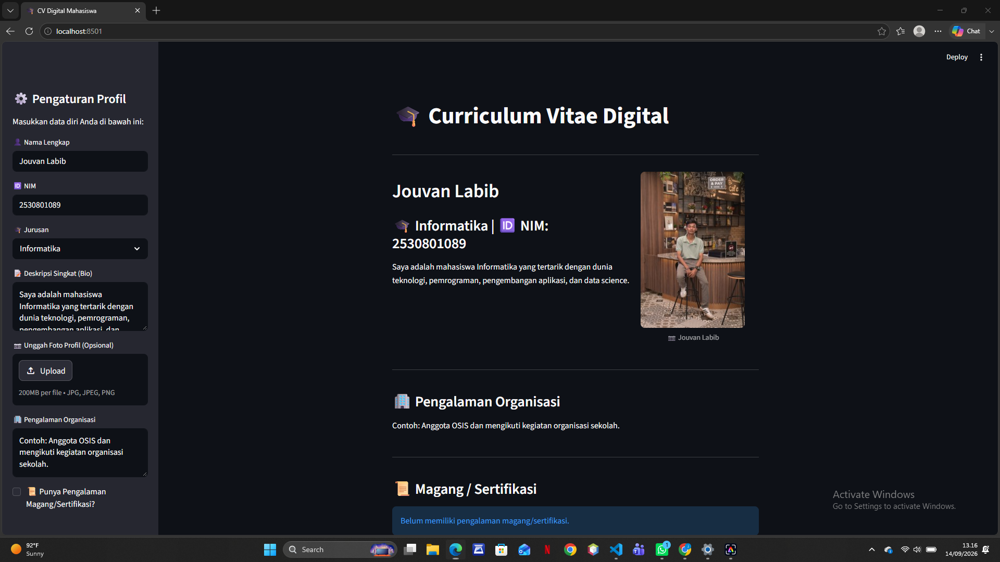

# LAPORAN PRAKTIKUM

## CV Digital Mahasiswa Berbasis Streamlit

### 1. Judul

**CV Digital Mahasiswa Berbasis Streamlit**

### 2. Deskripsi

Program ini merupakan aplikasi **Curriculum Vitae (CV) Digital Mahasiswa** yang dibuat menggunakan Python dan Streamlit. Aplikasi digunakan untuk menampilkan informasi mahasiswa dalam bentuk CV digital yang interaktif.

Pengguna dapat mengatur data profil melalui sidebar, seperti nama, NIM, jurusan, deskripsi singkat, foto profil, pengalaman organisasi, pengalaman magang atau sertifikasi, serta tingkat kemampuan teknis.

### 3. Tampilan Profil

Berdasarkan hasil percobaan, aplikasi menampilkan data profil sebagai berikut:

| Data        | Hasil Percobaan                                                                                            |
| ----------- | ---------------------------------------------------------------------------------------------------------- |
| Nama        | Jouvan Labib                                                                                               |
| NIM         | 2530801089                                                                                                 |
| Jurusan     | Informatika                                                                                                |
| Foto Profil | Ditampilkan                                                                                                |
| Deskripsi   | Mahasiswa Informatika yang tertarik dengan teknologi, pemrograman, pengembangan aplikasi, dan data science |

Pada halaman utama terdapat judul:

**🎓 Curriculum Vitae Digital**

Kemudian informasi nama, jurusan, NIM, deskripsi singkat, dan foto profil ditampilkan dalam dua kolom.

### 4. Pengaturan Profil

Bagian sidebar **⚙️ Pengaturan Profil** digunakan untuk memasukkan dan mengubah data diri.

Pada hasil percobaan, data yang digunakan adalah:

* **Nama Lengkap:** Jouvan Labib
* **NIM:** 2530801089
* **Jurusan:** Informatika
* **Deskripsi Singkat:** Saya adalah mahasiswa Informatika yang tertarik dengan dunia teknologi, pemrograman, pengembangan aplikasi, dan data science.

Sidebar juga menyediakan fitur **Unggah Foto Profil (Opsional)** dengan format file JPG, JPEG, dan PNG.

### 5. Pengalaman Organisasi

Pada bagian **🏢 Pengalaman Organisasi**, aplikasi menampilkan data:

```text
Contoh: Anggota OSIS dan mengikuti kegiatan organisasi sekolah.
```

Hasil percobaan menunjukkan bahwa data tersebut berhasil ditampilkan pada halaman utama CV.

### 6. Magang / Sertifikasi

Pada sidebar terdapat pilihan:

**📜 Punya Pengalaman Magang/Sertifikasi?**

Dalam percobaan, checkbox tersebut **tidak diaktifkan**.

Oleh karena itu, halaman utama menampilkan:

```text
Belum memiliki pengalaman magang/sertifikasi.
```

Hal ini menunjukkan bahwa program berhasil menyesuaikan tampilan berdasarkan kondisi checkbox.

### 7. Keahlian Teknis

Bagian **🛠️ Keahlian Teknis** menampilkan tiga kemampuan dengan progress bar.

Hasil percobaan menunjukkan:

| Keahlian                   | Persentase |
| -------------------------- | ---------: |
| Python                     |        80% |
| Web Development (HTML/CSS) |        60% |
| Database (SQL)             |        70% |

Progress bar berhasil menampilkan tingkat kemahiran masing-masing skill secara visual.

### 8. Hubungi Saya

Pada bagian **📬 Hubungi Saya**, terdapat tombol expander:

**👆 Klik untuk melihat detail kontak**

Expander digunakan untuk menyembunyikan detail kontak dan dapat dibuka oleh pengguna ketika diperlukan.

Format kontak dibuat secara otomatis berdasarkan nama pengguna yang dimasukkan pada profil.

Untuk nama **Jouvan Labib**, sistem mengubah nama menjadi:

```text
jouvanlabib
```

Kemudian digunakan untuk membentuk alamat email, LinkedIn, dan GitHub.

### 9. Download Data CV

Pada bagian **📥 Download Data CV**, terdapat tombol:

**📥 Download Data CV**

Fitur ini digunakan untuk mengunduh data dasar CV dalam bentuk file teks.

Data yang dimasukkan ke dalam file meliputi:

```text
Nama: Jouvan Labib
NIM: 2530801089
Jurusan: Informatika
```

Nama file yang digunakan adalah:

```text
cv_jouvan_labib.txt
```

### 10. Hasil Percobaan

Berdasarkan dua screenshot hasil pengujian, aplikasi berhasil menampilkan seluruh bagian utama CV.

**Hasil pada tampilan awal:**

* Sidebar pengaturan profil berhasil ditampilkan.
* Nama **Jouvan Labib** berhasil ditampilkan.
* NIM **2530801089** berhasil ditampilkan.
* Jurusan **Informatika** berhasil ditampilkan.
* Foto profil berhasil ditampilkan.
* Deskripsi singkat berhasil ditampilkan.
* Pengalaman organisasi berhasil ditampilkan.
* Status magang/sertifikasi menampilkan **belum memiliki pengalaman**.

**Hasil pada tampilan bagian bawah:**

* Keahlian Python menampilkan **80%**.
* Web Development menampilkan **60%**.
* Database menampilkan **70%**.
* Bagian **Hubungi Saya** berhasil ditampilkan dalam bentuk expander.
* Bagian **Download Data CV** berhasil ditampilkan.
* Tombol download data CV tersedia dan dapat digunakan.

### 11. Alur Kerja Program

```text
Program dijalankan
        ↓
Sidebar Pengaturan Profil ditampilkan
        ↓
Input Nama, NIM, Jurusan, dan Bio
        ↓
Upload Foto Profil
        ↓
Input Pengalaman Organisasi
        ↓
Pilih Pengalaman Magang/Sertifikasi
        ↓
Atur Kemampuan Skill
        ↓
Data ditampilkan pada CV Digital
        ↓
Menampilkan Kontak
        ↓
Download Data CV
```

### 12. Teknologi yang Digunakan

Program menggunakan:

* **Python** sebagai bahasa pemrograman.
* **Streamlit** sebagai framework untuk membuat aplikasi web interaktif.
* **JPG/JPEG/PNG** untuk format foto profil.
* **TXT** untuk file hasil download data CV.

### 13. Kesimpulan

Berdasarkan hasil percobaan, aplikasi **CV Digital Mahasiswa** berhasil dijalankan menggunakan Streamlit. Data profil Jouvan Labib, NIM 2530801089, jurusan Informatika, foto profil, pengalaman organisasi, status magang/sertifikasi, keahlian teknis, kontak, dan fitur download CV berhasil ditampilkan sesuai dengan fungsi yang dibuat pada program.

### 14. Bukti Pengujian


.png)