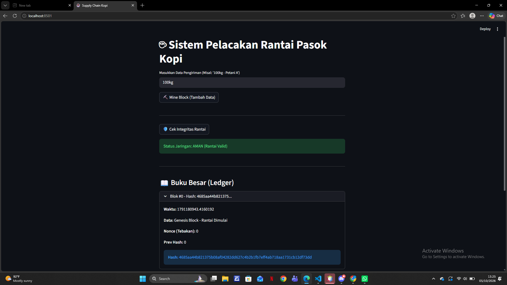

# LAPORAN PRAKTIKUM

## Sistem Pelacakan Rantai Pasok Kopi Berbasis Blockchain

### 1. Judul

**Sistem Pelacakan Rantai Pasok Kopi Berbasis Blockchain**

### 2. Deskripsi

Program ini merupakan implementasi sederhana teknologi blockchain untuk melakukan pencatatan data pada rantai pasok kopi. Data pengiriman disimpan ke dalam block dan setiap block saling terhubung menggunakan hash.

Program dibuat menggunakan **Python** dengan **Streamlit** sebagai antarmuka pengguna. Sistem juga menerapkan proses **Proof of Work (PoW)** untuk melakukan mining serta fitur validasi untuk memeriksa integritas blockchain.

### 3. Fitur Program

Program memiliki beberapa fitur utama:

* **Input Data Pengiriman**
  Pengguna dapat memasukkan data pengiriman kopi, contohnya `100kg`.

* **Mine Block (Tambah Data)**
  Data yang dimasukkan akan dibuat menjadi block baru dan melalui proses mining sebelum ditambahkan ke blockchain.

* **Cek Integritas Rantai**
  Digunakan untuk memastikan bahwa data pada blockchain masih valid dan belum mengalami perubahan.

* **Buku Besar (Ledger)**
  Menampilkan informasi setiap block yang terdapat dalam blockchain.

### 4. Struktur Block

Setiap block memiliki beberapa atribut berikut:

| Atribut         | Keterangan                               |
| --------------- | ---------------------------------------- |
| `index`         | Nomor urut block                         |
| `timestamp`     | Waktu saat block dibuat                  |
| `data`          | Data yang disimpan dalam block           |
| `previous_hash` | Hash dari block sebelumnya               |
| `nonce`         | Nilai yang digunakan dalam proses mining |
| `hash`          | Hash yang dihasilkan dari data block     |

Hash block dihitung menggunakan algoritma **SHA-256**.

### 5. Genesis Block

Ketika program dijalankan, blockchain secara otomatis membuat **Genesis Block** sebagai block pertama.

Pada hasil pengujian, Genesis Block ditampilkan sebagai:

```text
Blok #0
Data: Genesis Block - Rantai Dimulai
Nonce (Tebakan): 0
Prev Hash: 0
```

Genesis Block menjadi awal dari rantai blockchain dan digunakan sebagai dasar untuk block berikutnya.

### 6. Proses Mining

Program menerapkan **Proof of Work (PoW)** dengan tingkat kesulitan:

```python
difficulty = 3
```

Artinya, sistem akan mencari nilai `nonce` sampai hash yang dihasilkan memiliki tiga karakter awal berupa:

```text
000
```

Nilai `nonce` akan terus bertambah selama hash belum memenuhi tingkat kesulitan tersebut.

### 7. Penambahan Data Pengiriman

Pada pengujian program, data yang dimasukkan melalui kolom:

```text
Masukkan Data Pengiriman
```

adalah:

```text
100kg
```

Setelah pengguna menekan tombol:

**⛏️ Mine Block (Tambah Data)**

program akan membuat block baru, menghubungkannya dengan block sebelumnya, kemudian melakukan proses mining.

### 8. Validasi Blockchain

Program menyediakan tombol:

**🛡️ Cek Integritas Rantai**

Pada hasil pengujian, sistem menampilkan:

```text
Status Jaringan: AMAN (Rantai Valid)
```

Hal tersebut menunjukkan bahwa hash setiap block masih sesuai dengan hasil perhitungan dan hubungan antara block saat ini dengan block sebelumnya masih benar.

### 9. Buku Besar (Ledger)

Bagian **📖 Buku Besar (Ledger)** digunakan untuk menampilkan informasi blockchain.

Pada hasil pengujian, Genesis Block ditampilkan dengan informasi:

```text
Blok #0 - Hash: 4685aa44b821375...

Waktu: 1791180943.4160192

Data: Genesis Block - Rantai Dimulai

Nonce (Tebakan): 0

Prev Hash: 0

Hash: 4685aa44b821375b08af04282dd627c4b2b1fb7eff4ab718aa1731cb12df73dd
```

Hash ditampilkan secara lengkap pada bagian informasi block.

### 10. Alur Kerja Sistem

```text
Program dijalankan
        ↓
Membuat Genesis Block
        ↓
Pengguna memasukkan data pengiriman
        ↓
Menekan Mine Block
        ↓
Membuat Block Baru
        ↓
Menentukan Previous Hash
        ↓
Proses Proof of Work
        ↓
Mencari Nonce
        ↓
Menghasilkan Hash
        ↓
Block ditambahkan ke Blockchain
        ↓
Data ditampilkan pada Ledger
        ↓
Cek Integritas Rantai
        ↓
Rantai Valid
```

### 11. Hasil Pengujian

Berdasarkan hasil pengujian pada aplikasi Streamlit:

| Pengujian                    | Hasil                   |
| ---------------------------- | ----------------------- |
| Aplikasi berhasil dijalankan | Berhasil                |
| Genesis Block dibuat         | Berhasil                |
| Input data `100kg`           | Berhasil                |
| Proses Mining                | Berhasil                |
| Tampilan Ledger              | Berhasil                |
| Cek Integritas Rantai        | **AMAN (Rantai Valid)** |

Tampilan aplikasi menunjukkan bahwa sistem berhasil menjalankan blockchain dan menampilkan data block melalui antarmuka Streamlit.

### 12. Kesimpulan

Berdasarkan hasil implementasi dan pengujian, sistem berhasil menerapkan konsep dasar blockchain pada pelacakan rantai pasok kopi. Data disimpan dalam block yang saling terhubung melalui hash dan proses mining menggunakan Proof of Work. Fitur validasi juga berhasil menunjukkan bahwa blockchain dalam kondisi **valid dan aman** ketika tidak terdapat perubahan pada data.

### 13. hasil laporannya

